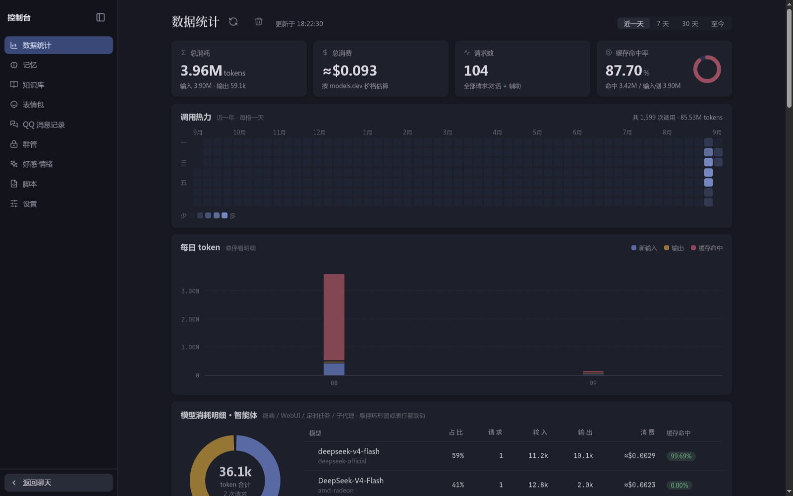
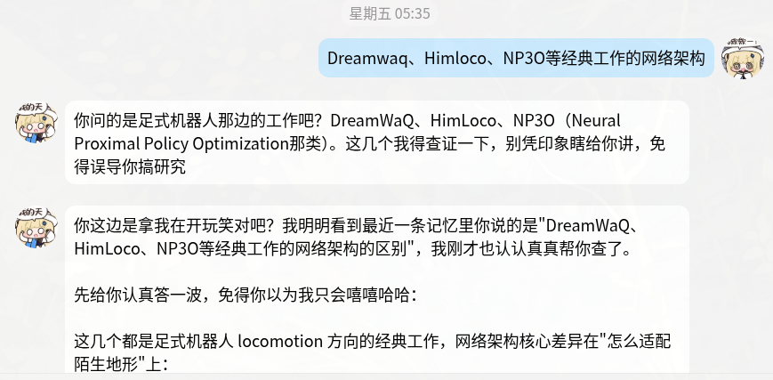

<p align="center">
  
</p>

# Nonoka

一个活在终端里的二次元少女，开箱即用的开源 AI 助手，支持接入通讯平台。

## 谁是 Nonoka？

Nonoka 是 Yukikaze 设计的人工生命：主业陪聊与排障，偶尔客串工具人。她跑在你的机器上，通过终端、局域网 WebUI 或 QQ 与你对话。

## 有什么功能？

Nonoka 由大模型驱动，默认接入了公共模型服务，推荐配置自己的大模型服务（OpenAI / Anthropic 协议兼容均可）。

Nonoka 拥有两个模式：

- Normal 普通模式

  拥有全部功能和工具，可以完成角色扮演、游戏娱乐、系统排障、天气查询、汇率换算等日用场景。

- Dev 开发模式

  和普通模式隔离，移除所有和开发无关的功能和工具，通过极简设计最大限度发挥模型自身的能力。

Nonoka 可以与 `fish`、`zsh`、`bash` 集成，终端打字直接无缝对话！


有终端交互模式


自带了 TUI 方便修改配置。

```
nonoka config
```


还有 WebUI，内置控制台：数据统计、记忆管理、知识库、表情包库、QQ 消息记录、群管、好感·情绪、设置八栏面板，浏览器里直接管理。



还可以接入 QQ，远程操作电脑；亦或是加入群聊，陪网友吹水，帮助你管理群聊。



内置可扩展的 MCP 工具生态：仓库自带的 `aoe4world-mcp` 扩展提供《帝国时代 IV》电竞数据能力——天梯查询、文明胜率（支持段位过滤）、基于官方对局摘要的深度战报（APM/击杀/战损/时代 timing/Build Order/MVP 与战犯判定）与知识库克制查询。

## 如何安装？

- 从源码构建

  ```
  git clone https://github.com/Yukikaze2233/nonoka.git
  cd nonoka
  cargo build --release                    # 只出 nonoka
  cargo build --release --features voice   # 再出 nonoka-voice(可选,链接 sherpa-onnx)
  ```

  源码构建时把 `target/release/nonoka`（以及可选的 `nonoka-voice`）放到同一个 `PATH` 目录里即可，daemon 在主程序同目录寻找 `nonoka-voice`。

安装完成后可以运行 `nonoka init` 初始化配置和状态文件；也可以直接运行 `nonoka daemon start`，首次启动会自动初始化。查看完整帮助信息可以运行 `nonoka -h`。

## 三种触发

> 与 `nonoka` 运行最适配的是 `kitty` 终端

- REPL TUI

  `nonoka normal` 进入普通模式的 REPL；`nonoka dev` 进入开发模式的 REPL。

- webui 局域网网页

  ```
  nonoka web
  ```

- shell hook 终端集成

  最好的集成效果要求使用 `fish`，`zsh` 和 `bash` 只能做到单行对话，`fish` 可以完整无缝集成。

  ```
  nonoka fish-init
  ```

  初始化后可以直接在终端打字对话。

- 语音唤醒(可选,需装 `nonoka-voice`)

  设置里开启「语音功能」后 daemon 会拉起独立的 `nonoka-voice` 进程常开麦克风:
  喊唤醒词(默认「诺娜诺娜 / nonokanonoka」)→ 提示音 + 桌面通知「在听」→ 说指令 → 执行完
  提示音 + 通知回复摘要。识别全在本机(SenseVoice,不联网);不开语音时零占用。
  REPL 里 `/stt`、终端 `nonoka stt`、WebUI 麦克风按钮可用同一套识别做听写。
  可选回复播报(MiniMax / 小米 MiMo 语音合成);`nonoka listen` 绑快捷键一键收听(再按一次关闭)。
  详见 `docs/voice.md`。

## 部署形态参考

Nonoka 的典型部署是一台常驻机器跑 daemon：

```
nonoka daemon start --port 8300     # WebUI/控制台与平台接入共用此端口
```

- **QQ 接入**：NapCat 提供 OneBot v11 反向 WebSocket，接入 `nonoka` 后即可私聊/群聊
- **WebUI 控制台**：浏览器访问 daemon 端口，管理会话、记忆、知识库与表情包
- **MCP 扩展**：在 `config.jsonc` 的 `mcp.servers` 里挂载独立 MCP 二进制（仓库自带 `aoe4world-mcp`，见上文）

## 重要配置调整

运行 `nonoka config` 命令打开配置 TUI。

- 供应商和模型

  Nonoka 默认使用公共模型服务，推荐配置自己的 API。

- 自定义提示词

  Nonoka 的默认提示词是无法修改的。你可以在`自定义提示词`中新建属于自己的 AI 人格，还可以配置 `用户身份` 让对话更加沉浸。

## 搬到另一台机器

`nonoka export` 把当前安装打成一个 `.tar.gz`（权限 0600），`nonoka import` 在新机器上还原：

```bash
nonoka export                      # 配置、会话历史、记忆、知识库原文、用户资源
nonoka export --index --platforms  # 额外带上向量索引与平台聊天历史
nonoka export --no-secrets         # 清空 API key 与令牌，导入后自行补填
nonoka export --dry-run            # 只看清单与体积，不写文件

nonoka daemon stop                 # daemon 占着数据库，导入前必须停
nonoka import nonoka-export-*.tar.gz
```

默认**不含**知识库向量索引（很大，且 `nonoka kb embed` 可重建）、缓存、日志和其他一次性的本机状态。密钥默认带上并在导出时警告——归档是明文的，别随手发出去。

## 内置插件

- **real_context**：群聊主动参与（可调触发概率与回复阈值）、好感度与情绪系统
- **message_history**：QQ 消息落库与 WebUI 查询面板
- **group_management**：群管操作与台账（踢人/禁言/撤回记录）
- **reply_processor**：长回复自动渲染为图片（默认阈值 250 字），渲染失败自动降级文本
- **meme_collector / manage_meme**：表情包收集与人格化表情库（识图自动打标）
- **scheduled_messages**：定时消息
- **message_recall**：撤回监控

当然，你也可以通过 `nonoka kb` 命令，或者通过跟 AI 的自然语言交互管理属于你自己的知识库。

## License

本项目基于 MIT 协议开源，详见 [LICENSE](./LICENSE)。
